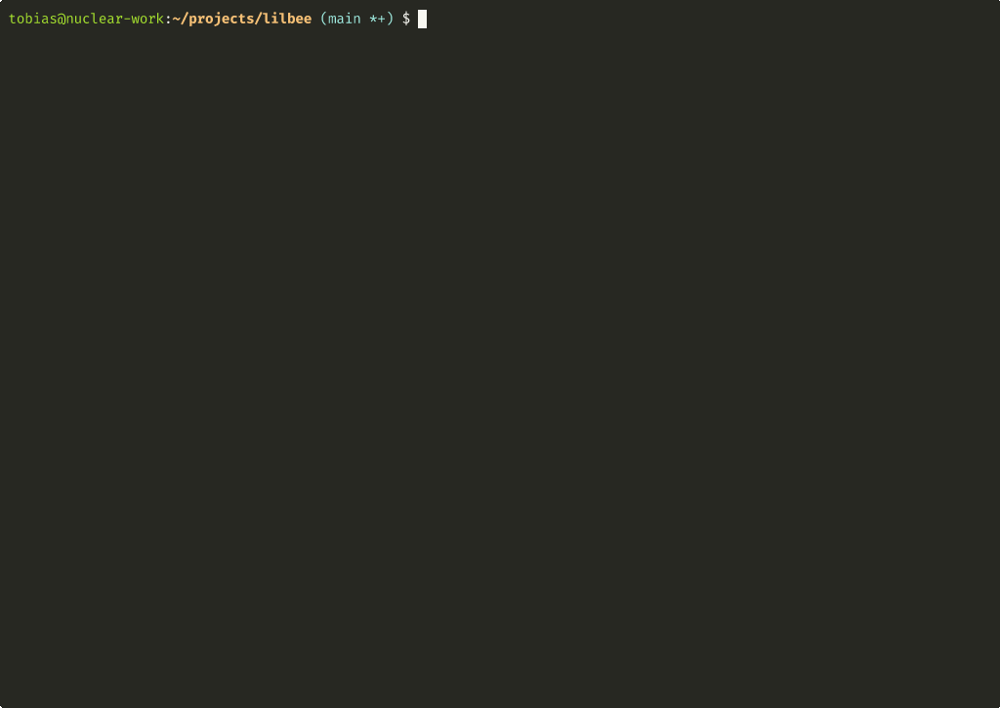

# lilbee

[](https://github.com/tobocop2/lilbee/actions/workflows/ci.yml)
[](https://www.python.org/downloads/)
[](#testing)
[](LICENSE)

> **Experimental** — under active development, expect breaking changes.

<p align="center">
  
</p>

A terminal tool that gives local LLMs long-term memory over your documents. Drop in PDFs, source code, markdown, or HTML — ask questions and get answers with source citations, entirely from the command line.

lilbee augments local models with retrieval-augmented generation (RAG), so a small model running on your laptop can answer detailed questions about thousands of pages it was never trained on. Everything runs on your machine via [Ollama](https://ollama.com) — no cloud APIs, no API keys, no data leaves your computer.

## What it does

Most document Q&A tools require a browser, an account, or sending your files to a third party. lilbee is for people who want to ask questions about a pile of documents without leaving the terminal.

1. **Drop documents** into a folder — PDFs, `.md`, `.txt`, `.html`, `.rst`, or source code (`.py`, `.js`, `.go`, `.rs`, etc.)
2. **lilbee auto-ingests** them: extracts text, chunks it intelligently (token-based for text, AST-aware for code via tree-sitter), embeds with a local model, and stores vectors in LanceDB
3. **Ask questions** — lilbee retrieves the most relevant chunks, feeds them to a local LLM, and streams an answer with page/line citations back to the source

```
$ lilbee ask "What is the recommended oil change interval?"

The recommended oil change interval is every 7,500 miles using
5W-30 full synthetic oil.

Sources:
  → vehicle_manual.pdf, pages 42-43
```

## Install

### Prerequisites

- Python 3.11+
- [Ollama](https://ollama.com) installed and running
- Pull models (one-time):
  ```bash
  ollama pull mistral && ollama pull nomic-embed-text
  ```

### Install

```bash
git clone https://github.com/tobocop2/lilbee && cd lilbee
pip install .        # or: uv tool install .
```

After this, `lilbee` is available as a command.

### Development (run from source)

```bash
git clone https://github.com/tobocop2/lilbee && cd lilbee
uv sync
# Prefix all commands with uv run:
uv run lilbee ask "question"
```

## Quick start

```bash
# Drop files into the documents directory
# Default location varies by platform (see Data Location below)
lilbee status  # Shows the documents path

# Ask a question (auto-ingests new documents)
lilbee ask "How do I change the oil?"

# Interactive chat
lilbee chat

# Use a different LLM
lilbee ask "Explain this code" --model llama3
```

> Running from source? Prefix with `uv run` (e.g. `uv run lilbee ask ...`).

## Commands

| Command | Description |
|---------|-------------|
| `lilbee ask "question"` | One-shot question with auto-sync |
| `lilbee chat` | Interactive chat loop |
| `lilbee sync` | Manually trigger document sync |
| `lilbee rebuild` | Nuke DB and re-ingest everything |
| `lilbee status` | Show indexed documents, paths, and models |

All commands accept `--data-dir PATH` to override the data location and `--model NAME` to override the chat model.

## Configuration

All settings are configurable via environment variables:

| Variable | Default | Description |
|----------|---------|-------------|
| `LILBEE_DATA` | *(platform default)* | Data directory path |
| `LILBEE_CHAT_MODEL` | `mistral` | Ollama chat model |
| `LILBEE_EMBEDDING_MODEL` | `nomic-embed-text` | Ollama embedding model |
| `LILBEE_EMBEDDING_DIM` | `768` | Embedding vector dimensions |
| `LILBEE_CHUNK_SIZE` | `512` | Tokens per chunk |
| `LILBEE_CHUNK_OVERLAP` | `100` | Overlap tokens between chunks |
| `LILBEE_TOP_K` | `10` | Number of retrieval results |

## How it works

```
documents/          LanceDB             Ollama
┌──────────┐       ┌──────────┐       ┌──────────┐
│ PDFs     │──────→│ vectors  │──────→│ LLM      │
│ code     │ hash  │ + chunks │ top-K │ (any     │
│ markdown │ sync  │          │ search│  model)  │
└──────────┘       └──────────┘       └──────────┘
     ↑                                     │
     │              answer + citations     │
     └─────────────────────────────────────┘
```

- **Auto-sync**: SHA-256 hashes track which files changed. New files are ingested, modified files re-ingested, deleted files removed from the index.
- **Text chunking**: Token-based recursive splitting (512 tokens, 100 overlap) on paragraph/sentence/word boundaries.
- **Code chunking**: Tree-sitter AST parsing extracts functions and classes as natural chunks. Supports Python, JavaScript, TypeScript, Go, Rust, Java, C, C++.
- **PDF extraction**: `pymupdf4llm` converts PDFs to markdown with page tracking.

## Data location

lilbee stores documents and its vector database in a platform-standard location:

| Platform | Path |
|----------|------|
| macOS | `~/Library/Application Support/lilbee/` |
| Linux | `~/.local/share/lilbee/` |
| Windows | `%LOCALAPPDATA%/lilbee/` |

Inside that directory:
```
lilbee/
├── documents/    # Drop your files here
└── data/
    └── lancedb/  # Vector database (auto-managed)
```

Override with `LILBEE_DATA=/path/to/dir` or `--data-dir`.

## Tech stack

| Component | Tool |
|-----------|------|
| Language | Python 3.11+ |
| Package manager | uv |
| LLM runtime | Ollama (local, any model) |
| Embeddings | nomic-embed-text (configurable) |
| Vector DB | LanceDB (embedded, Rust-based) |
| PDF extraction | pymupdf4llm |
| Code parsing | tree-sitter |
| CLI | Typer + Rich |

## Testing

```bash
# Unit tests (no Ollama needed)
make test

# Full suite including RAG accuracy (requires Ollama + models)
uv run pytest tests/ -v
```

Accuracy tests generate a PDF with known facts and verify that lilbee retrieves correct answers with proper source attribution. Unit tests mock all external dependencies and target 100% coverage.

## License

MIT
