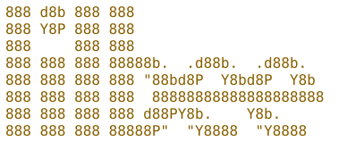

<p align="center">
  <picture>
    <source media="(prefers-color-scheme: dark)" srcset="docs/lilbee-logo-dark.svg">
    
  </picture>
</p>

<p align="center"><strong>A batteries-included local search engine for your data and code that you can talk to.</strong></p>

<p align="center"><a href="https://lilbee.sh/">Project site</a> &nbsp;·&nbsp; <a href="https://pypi.org/project/lilbee/">PyPI</a> &nbsp;·&nbsp; <a href="https://obsidian.lilbee.sh/">Obsidian plugin</a> &nbsp;·&nbsp; <a href="https://lilbee.sh/api/">REST API</a></p>

<p align="center">
  <a href="https://github.com/tobocop2/lilbee/releases"></a>
  <a href="https://pypi.org/project/lilbee/"></a>
  <a href="https://www.python.org/downloads/"></a>
  <a href="https://github.com/tobocop2/lilbee/actions/workflows/ci.yml"></a>
  <a href="https://lilbee.sh/coverage/"></a>
  <a href="https://mypy-lang.org/"></a>
  <a href="https://github.com/astral-sh/ruff"></a>
  
  <a href="LICENSE"></a>
  <a href="https://pepy.tech/project/lilbee"></a>
  <a href="https://github.com/tobocop2/lilbee/releases"></a>
</p>

Point it at your files, notes, and code and ask questions in plain English; every answer links back to the file and line it came from. Point it at nothing and it's still a clean local-AI chat with the model catalog wired up; cloud models too if you bring an API key, and an MCP server so any agent that speaks MCP can drive it.


It's all one program: a full-screen terminal app, a command-line tool, a Model Context Protocol server, an HTTP API, and a Python library. Run it when you want, close it when you're done; nothing left running in the background, no container to keep alive. It runs on your computer; lilbee uses a cloud model only when you pick one.

> **Tutorial reel:** every demo on this page (and the extras) as a real video player at [**lilbee.sh/tutorial.html**](https://lilbee.sh/tutorial.html).

> ## ⚠️ Beta software
>
> lilbee is in **active beta** development. Every release on PyPI is a pre-release; you must use `--pre` (or uv's `--prerelease=allow`) when installing. Interfaces, command names, and on-disk formats may shift between betas. Feedback, bug reports, and issues are very welcome; that's the whole point of the beta.
>
> Latest pre-release (always): [lilbee on PyPI →](https://pypi.org/project/lilbee/)

---

- [Quick start](#quick-start)
- [Tutorial reel](https://lilbee.sh/tutorial.html) (long-form videos)
- [Highlights](#highlights)
- [Why lilbee](#why-lilbee)
- [What you can do with it](#what-you-can-do-with-it)
- [TUI](#tui)
- [Hardware requirements](#hardware-requirements)
- [Install](#install)
- [Agent integration](#agent-integration)
- [HTTP Server](#http-server) · [REST API reference](https://lilbee.sh/api/)
- [Supported formats](#supported-formats)
- [Experimental](#experimental)

---

## Quick start

Two recommended ways to use lilbee, depending on whether you're the one driving:

- **Run `lilbee`** for the full-screen terminal app. A welcome wizard picks a chat and embedding model, then you index files, search, and chat without leaving the TUI. The Settings screen exposes every retrieval knob (search depth, distance threshold, reranker, chunking) so you can tune lilbee to your library shape.
- **Wire it into your agent over MCP.** Any MCP-aware coding agent calls `lilbee_search` / `lilbee_add` and gets back cited snippets it can quote. Agents can also *fine-tune lilbee on the fly* via `lilbee_settings_set`. Drop in the [lilbee-mcp skill](docs/agent-skills/lilbee-mcp/SKILL.md) and the agent reads the full surface — every tool, every retrieval knob, and when to widen for prose vs narrow for code. See [Agent integration](#agent-integration).

**Fine-tuning is a first-class capability.** Defaults are sane and balanced for the common cases: chatting with your code, with code documentation, with crawled websites, and with long-form PDFs (manuals, ebooks, research papers). Every retrieval setting is writable — through the TUI Settings screen, `/set` slash command, MCP `lilbee_settings_set`, or `config.toml`. When the answer feels thin (or noisy), the right knob to move is usually `top_k`, `max_distance`, or `diversity_max_per_source`. The agent integration above lets a coding agent move them for you while you stay in chat.

CLI commands, the HTTP API, environment variables, and `config.toml` are also there as reference for scripting, headless runs, and custom integrations; you should not need them for everyday use. See the [usage guide](docs/usage.md).

All the install options are in [Install](#install) below: pip, uv, Homebrew, AUR, Docker, Nix, a standalone binary (no Python), CUDA wheels, or from source. Optional extras (`[crawler]`, `[litellm]`, `[graph]`) are there too.

## Highlights

- **One install, many surfaces.** TUI, CLI, [MCP server](#agent-integration), [REST API](https://lilbee.sh/api/), and Python library, all from a single `pip install`. No daemon, no inference server, no vector database to stand up.
- **Answers cite the source line.** Click a citation, jump to the file at the exact line.
- **Indexes anything textual.** PDFs, Office files, ebooks, source in 150+ languages, scanned pages (OCR), and crawled documentation sites.
- **Models from Hugging Face, inside the app.** Browse the catalog, pull a model, assign it to a role. No external CLI.
- **Native runtime, with an off-ramp.** Models run in-process via [`llama-cpp-python`](https://github.com/abetlen/llama-cpp-python), so lilbee's local catalog tracks what llama-cpp-python can load and lags Ollama on the newest architectures. For those, point lilbee at a running Ollama (or any OpenAI-compatible local backend) and its models show up in the picker alongside your native ones.
- **Per-project libraries.** Drop `.lilbee/` next to `.git/` for a project-scoped index, or run globally for a household-scale one.
- **Local by default.** Everything stays on your machine unless you opt into a cloud model, and lilbee flags it when you do.
- **Agent-tunable over MCP.** Agents can swap models, widen retrieval, and rebuild the index without you leaving chat. [See it in action](#let-the-agent-set-up-lilbee-for-you).
- **Compact.** If you already have Python, the wheel is 6 MB on macOS arm64, 20 MB on Windows x86_64, and 47 MB on Linux x86_64 (the manylinux build carries a wider CPU baseline). The single-file standalone binary, which folds Python, the model runtime, OCR, the crawler, and the vector store, lands around 253-365 MB across Linux, macOS, and Windows. Comparable all-in-one desktop AI apps typically ship several hundred megabytes of Electron and runtime before any models load.

## Why lilbee

The first evening with a local model is fun. What makes it more than a novelty is grounding: the model needs context from your notes, your files, your code, or it runs out of places to go. lilbee pairs the chat with a real search engine over a set of documents you choose, so a local model can reason over your world and answer with citations you can click back to the source.

Standing this up used to mean a background daemon, a separate inference server, model files fetched by hand, and a retrieval layer glued on top. lilbee folds all of it into one install, in one process, in the terminal. Run it globally, or scope a library per project by dropping a `.lilbee/` next to `.git/`, the same pattern git uses; a focused library answers better than one catch-all pile of everything.

> **The long-term goal:** an [Encarta 99](https://en.wikipedia.org/wiki/Encarta) you build for yourself, from your own files, shaped to your needs.

## What you can do with it

### A library of your own files

Point lilbee at a folder of PDFs, notes, ebooks, or code and it builds a searchable library, with citations that click back to the source line. The pattern works for anything you have a lot of text about: a medical-textbook collection, a field's research papers, a car's service manuals, your company's internal wiki. Whatever you give it becomes searchable, and you can talk to it.


### Let the agent set up lilbee for you

The fastest path to a useful lilbee install is to hand it to an MCP-aware agent and let it do the setup. `lilbee_catalog_browse` lets the agent see what's available, `lilbee_model_pull` installs picks, and `lilbee_settings_set` wires them into the embedding / reranker / vision roles and tunes the retrieval knobs for the library and question style you actually care about. No TUI, no config file, no restart. The agent already knows what chunk size, MMR weight, and reranker depth do. See [Fine-tuning lilbee from your agent](docs/agent-integration.md#fine-tuning-lilbee-from-your-agent) for the example prompt.

### Grounding for AI agents

Once configured, lilbee plugs into whatever agent you use, over MCP. Feed it your project's docs, your dependency source, your API docs, your design notes; the agent stops making up function names and instead reads the actual code, cites file and line, and says it doesn't know when the answer isn't in your library.

lilbee stays the local part: your files, the search index, and the embeddings never leave your machine. The agent calls `lilbee_search` and gets back cited snippets. The demo below is lilbee talking to lilbee: an agent indexes lilbee's own source, then answers questions about how lilbee works with file:line citations.


When the first answer is thin, the agent fine-tunes lilbee mid-conversation, then re-answers with full function bodies, file:line included.


### Offline copies of websites

Install the `[crawler]` extra, point lilbee at a docs site, a wiki, or a vendor's API reference, and the pages get fetched, converted to markdown, and added to your library. From then on you can search or chat with that copy of the site offline, even after it changes or goes down.


### How it's built

lilbee stands on established open-source projects, all embedded in one process:

- [Kreuzberg] parses documents
- [LanceDB] is the embedded search layer
- [tree-sitter] chunks code
- [llama-cpp][llama-cpp-python] runs models locally
- [crawl4ai] and [Playwright] crawl the web
- [Textual] draws the terminal

### Documents, code, and scanned images

Most retrieval tools throw your files at a PDF extractor and call it done. lilbee splits the work by what's being indexed:

- **Prose and structured documents** (90+ formats: PDFs, Office files, ebooks, HTML, and more) go through [Kreuzberg]'s extraction pipeline with heading-aware chunking, so each chunk keeps its section context.
- **Code** goes through [tree-sitter]'s AST-aware splitter across [150+ languages](https://github.com/Goldziher/tree-sitter-language-pack), so chunks map to real functions, classes, and modules instead of arbitrary line ranges.
- **Scanned PDFs and photos** go through OCR: Tesseract for plain text, a local GGUF vision model that keeps tables and layout as markdown, or a remote vision model.

Retrieval returns things that make sense on their own, not fragments cut through an argument or a function signature.

### Pick and tune your models

Chat, embedding, vision, and reranking models are installed and switched from inside the terminal: browse the catalog, pull a model, pick a role. Retrieval and generation expose 50+ settings (chunk size, search strictness, a second-pass re-scorer, how much weight topic relationships carry), edited from the TUI, environment variables, or a project-local config file. Sane defaults out of the box.


### See when a model won't load before you download it

Hugging Face has thousands of GGUFs but the bundled llama.cpp build only supports a subset of architectures; brand-new ones land upstream first and take time to reach the pinned runtime. lilbee reads `general.architecture` from the Hub for every catalog row and tags unsupported ones with an `unsupported` pill on the card and an italic tag in the list view. Trying to install one opens a confirm dialog ("pull anyway?") so you can override when you know better, otherwise pulls are refused before the multi-GB download.


### Cloud models, when you want them

lilbee runs entirely on your machine by default. There are two ways to use cloud models when you want to:

- **Bring your own key, inside lilbee.** Install the `[litellm]` extra and add an API key, then point the chat / embedding / vision / rerank role at a cloud model from the same model catalog. The TUI shows a persistent warning whenever a cloud role is active, so it's clear when chunks are leaving the machine.
- **Pair lilbee with a cloud agent over MCP.** lilbee stays the local part: your files, the embeddings, the search index. Any MCP-aware agent calls `lilbee_search` / `lilbee_add` and gets back cited snippets. The Godot demo above is exactly this shape: a cloud-hosted coding agent on top of opencode, with the indexed Godot 4 reference and the search both running locally.

Either way your files and the index never leave the machine; only the queries and the snippets the model needs to answer cross the wire when you opt in.

## TUI

`lilbee` (no args) launches a full Textual terminal app: streaming chat with clickable citations, a model bar with searchable pickers and a Search/Chat toggle, a Task Center for background jobs, and screens for the model catalog, settings, the setup wizard, and the auto-built wiki. Type `/` for the command list; tab completion works everywhere.


`Ctrl+P` opens the Textual command palette, `?` toggles the keybinding cheat sheet, `/help` opens the slash-command catalog. Every action lilbee can take is reachable from one of those three.


Every GIF on this page (plus the extras that don't fit here) is at [**lilbee.sh/tutorial.html**](https://lilbee.sh/tutorial.html) as an embedded video with long-form captions. Tape sources are in [`demos/`](demos). For commands and settings, see the [usage guide](docs/usage.md).

## Hardware requirements

Standalone mode runs entirely on your machine. No cloud required.

### Supported platforms

| Platform           | Minimum                                                                                                                                                                                                                                                                                                                | Recommended                                                                      |
| ------------------ | ---------------------------------------------------------------------------------------------------------------------------------------------------------------------------------------------------------------------------------------------------------------------------------------------------------------------- | -------------------------------------------------------------------------------- |
| **Linux x86_64**   | A 64-bit Intel or AMD CPU from **2013 or newer**: Intel Core i3/i5/i7 4th-gen (Haswell), Intel Xeon E3-12xx v3 / E5-26xx v3, AMD FX-95xx (Steamroller) or any AMD Zen-based chip. Anything corresponding to the [`x86-64-v3` microarchitecture level](https://en.wikipedia.org/wiki/X86-64#Microarchitecture_levels). | A modern Intel Core / Xeon / AMD Ryzen / EPYC + an NVIDIA, AMD, or Intel Arc GPU |
| **macOS arm64**    | Any Apple Silicon Mac (M1 or newer) running macOS 11+                                                                                                                                                                                                                                                                  | M-series Pro / Max / Ultra                                                       |
| **Windows x86_64** | A 64-bit Intel or AMD CPU from **2013 or newer** (same generations as Linux above), Windows 10/11                                                                                                                                                                                                                      | Modern desktop / workstation CPU + GPU                                           |
| **Linux ARM64**    | ARMv8 (NEON-capable): Raspberry Pi 4+, AWS Graviton, Ampere Altra, etc.                                                                                                                                                                                                                                                | Modern ARM server with 16+ GB RAM                                                |

### Resources

| Resource              | Minimum                                                  | Recommended                                                                                                                                                 |
| --------------------- | -------------------------------------------------------- | ----------------------------------------------------------------------------------------------------------------------------------------------------------- |
| **RAM**               | 8 GB                                                     | 16 to 32 GB if you load several local models at once (chat + embed + rerank + vision); the actual footprint scales with the size and quantization you pick |
| **GPU / Accelerator** | none required (CPU-only inference works)                 | Apple Silicon (Metal) · any NVIDIA / AMD / Intel Arc GPU (Vulkan) · NVIDIA GPU + matching CUDA toolkit (opt-in CUDA-native wheels, see [Install](#install)) |
| **Disk**              | 2 GB (models + data)                                     | 10+ GB if you load multiple models                                                                                                                          |

Each active inference role (chat, embed, rerank, vision) runs in its own subprocess to keep the TUI responsive, so the memory you need follows the size of the models you keep warm.

## Install

**Two routes, and the difference matters:**

- **Into your own Python** with `pip` or `uv` (Python 3.11 to 3.14). Smaller install, picks the fastest CPU code path for your machine at runtime, managed with the tools you already use. Recommended if you have Python.
- **A self-contained bundle**: the standalone binary, or the Homebrew / AUR / Nix / Docker builds that wrap it. Nothing else to install. The trade-off is a much larger download (the binary bundles its own Python runtime, `llama.cpp`, and the optional extras) and a small cold-start cost the first time it self-extracts. Recommended if you'd rather not deal with Python.

Have an NVIDIA GPU? Both routes have a CUDA build that's faster than the default Vulkan path. Skip to [On NVIDIA hardware](#on-nvidia-hardware).

No external services either way; lilbee downloads and runs models locally. Optional, for scanned-PDF / image OCR: [Tesseract](https://github.com/tesseract-ocr/tesseract) (`brew install tesseract` / `apt install tesseract-ocr`) or a [GGUF vision model](docs/usage.md#vision-models).

| How | Command | Notes |
| --- | --- | --- |
| **pip** | `pip install --pre lilbee` | Recommended. The default wheel runs on any x86_64 CPU and uses your GPU via Vulkan / Metal automatically. Intel Mac: add `--extra-index-url https://lilbee.sh/cpu/` ([browse wheels](https://lilbee.sh/cpu/lilbee/)). |
| **uv** | `uv tool install --prerelease=allow lilbee` | Same wheel as pip; fetches a Python for you if you need one. |
| **Homebrew** | `brew tap tobocop2/lilbee && brew install lilbee` | macOS arm64 / Linux x86_64. Bundled build; clears the macOS quarantine flag for you. |
| **AUR** | `paru -S lilbee` | Arch Linux. Wraps the Linux x86_64 binary; works with `yay` / `pacaur` / any helper. |
| **Docker** | `docker run --rm -v lilbee-data:/home/lilbee/data ghcr.io/tobocop2/lilbee:latest --help` | GHCR image, tagged by version and `latest`. Data lives at `/home/lilbee/data`. Mount a volume there. |
| **Nix** | `nix run github:tobocop2/lilbee` | NixOS, nix-darwin, or any host with nix. On Linux the flake bundles `glibc`, `libgomp`, and `vulkan-loader` so it runs on bare NixOS. |
| **Standalone binary** | [download for your platform &rarr;](https://github.com/tobocop2/lilbee/releases/latest) | One file, own Python runtime, no `pip` needed. Linux needs glibc 2.28+; the macOS / Windows builds are unsigned (`xattr -d com.apple.quarantine ./lilbee-macos-arm64` if Gatekeeper blocks it). |
| **From source** | `git clone https://github.com/tobocop2/lilbee && cd lilbee && uv sync && uv run lilbee` | For hacking on it. Needs `git` and `uv`. |

### On NVIDIA hardware

The default Vulkan build works on NVIDIA cards, but there is a dedicated CUDA build that links straight against `libcuda.so.1` from your driver. It sidesteps the iGPU + dGPU Vulkan-loader crash that bites NVIDIA-on-Windows setups and is the faster path on any box where you would otherwise rely on Vulkan over an NVIDIA card.

| | Command |
| --- | --- |
| **pip** | `pip install --pre lilbee --extra-index-url https://lilbee.sh/cu125/` |
| **Homebrew** | `brew install tobocop2/lilbee/lilbee-cuda` |
| **AUR** | `paru -S lilbee-cuda` |
| **Nix** | `nix run github:tobocop2/lilbee#lilbee-cuda` |
| **Binary** | [`lilbee-linux-x86_64-cu125`](https://github.com/tobocop2/lilbee/releases/latest) or [`lilbee-windows-x86_64-cu125.exe`](https://github.com/tobocop2/lilbee/releases/latest) |

Same `lilbee` command after install. The CUDA runtime (`cudart`, `cublas`) is bundled inside the binary; you only need the NVIDIA driver. Already have the regular `lilbee` installed? On AUR `paru -S lilbee-cuda` swaps it automatically (it `conflicts_with` / `provides` lilbee); on Homebrew run `brew uninstall lilbee` first. Older driver? `cu124` and `cu121` ship via the matching wheel indexes and as direct-download Linux binaries on the release page.

Then check it runs and pick a model:

```bash
lilbee self-check    # ~90 MB download; runs an inference + an embedding; "SELF-CHECK PASSED" on success
lilbee               # launch the terminal app; pick a chat + embedding model on the welcome screen
```

Everything past that lives in the [usage guide](docs/usage.md): the TUI tour at the top (welcome wizard, search/chat toggle, model bar, catalog, settings, slash commands, wiki), then a reference section for users driving lilbee from outside the TUI (CLI commands, HTTP server, MCP integration, env vars, `config.toml`, optional extras).

### Linux runtime requirements

The Linux x86_64 wheel and binary link the Vulkan loader at runtime. Most desktop distros (Ubuntu 22.04+, Pop!_OS, Mint) ship `libvulkan1`; bare Arch / Fedora / Alpine images don't, and `lilbee self-check` fails with `cannot open shared object file: libvulkan.so.1`. Install it once: `sudo pacman -S vulkan-icd-loader` (Arch / Manjaro), `sudo dnf install vulkan-loader` (Fedora, RHEL), or `sudo apt-get install libvulkan1` (Debian, Ubuntu).

### Optional extras

These only matter for a `pip` or `uv` install: add the name in brackets, e.g. `pip install --pre 'lilbee[crawler,litellm]'` (combine multiple, and `--extra-index-url` still works for CUDA). The standalone binary and the Homebrew / AUR / Nix / Docker builds already include all three. lilbee works without them either way.

| Extra | What it adds |
| --- | --- |
| `[crawler]` | Index websites alongside your files: crawl a docs site or wiki to markdown, then search it offline. Recursive crawl with Playwright, live progress, cancel, change detection, SSRF guards, rate limits. |
| `[litellm]` | Bridge to popular hosted model providers for chat, vision, or embeddings while other roles stay local. You provide the key; the TUI flags whenever a hosted model is active, and chunks sent to it leave your machine. |
| `[graph]` | Concept-graph search: extracts the ideas in your documents and uses how they relate to surface matches plain keyword search misses. No extra model calls. |

See the [full guide on optional extras](docs/usage.md#optional-extras) for configuration.

### Upgrading

```bash
pip install --upgrade --pre lilbee
# or
uv tool install --reinstall --prerelease=allow lilbee
```

## Agent integration

lilbee plugs into any agent over MCP or a JSON CLI. The repo ships a drop-in [`AGENTS.md`](demos/AGENTS.md), a [`lilbee-worker` subagent](demos/.opencode/agents/lilbee-worker.md) for long ops, and a reusable [`lilbee-mcp` skill](docs/agent-skills/lilbee-mcp/SKILL.md). See [docs/agent-integration.md](docs/agent-integration.md) to wire it up.

Live-indexing example: opencode on MiniMax M2.7 indexes a Godot 4 pathfinding subset (~3s), then `lilbee_search`-es for `AStarGrid2D` and answers method-by-method against your *local* files.


The same shape scales up. Pre-index Godot 4's full class reference (810 XMLs, 3449 chunks) and the agent can write a procedural level generator with every API call backed by a `godot-classes/<Class>.xml:line` citation; the [side-by-side benchmark](docs/benchmarks/godot-level-generator.md) measured 4 hallucinated APIs without lilbee, 0 with.


Every GIF on this page (plus the extras) is at [lilbee.sh/tutorial.html](https://lilbee.sh/tutorial.html) as a video with a longer caption.

## HTTP Server

`lilbee serve` starts a REST API any tool or GUI can hit: search (with SSE streaming), document lifecycle, crawling, model management, configuration. See the [REST API reference](https://lilbee.sh/api/) for the OpenAPI schema and the [usage guide](docs/usage.md#http-server) for invocation options. (These are HTTP server / REST docs; a Python-library reference is still in progress.)

The [Obsidian plugin](https://obsidian.lilbee.sh/) is a GUI built on it: it runs `lilbee serve` in the background, and every citation opens a Source Preview scrolled to the exact passage. Install via [BRAT](https://github.com/TfTHacker/obsidian42-brat); the [plugin README](https://github.com/tobocop2/obsidian-lilbee#quick-start) has setup.

## Supported formats

Text extraction powered by [Kreuzberg], code chunking by [tree-sitter]. Structured formats (XML, JSON, CSV) get embedding-friendly preprocessing. This list is not exhaustive; Kreuzberg supports additional formats beyond what's listed here.

| Format       | Extensions                                                                                                                                              | Requires                                                                                                                                                                                         |
| ------------ | ------------------------------------------------------------------------------------------------------------------------------------------------------- | ------------------------------------------------------------------------------------------------------------------------------------------------------------------------------------------------ |
| PDF          | `.pdf`                                                                                                                                                  | none                                                                                                                                                                                             |
| Scanned PDF  | `.pdf` (no extractable text)                                                                                                                            | [Tesseract](https://github.com/tesseract-ocr/tesseract) (auto, plain text), or a GGUF vision model via the native mtmd backend (recommended, preserves tables, headings, and layout as markdown) |
| Office       | `.docx`, `.xlsx`, `.pptx`                                                                                                                               | none                                                                                                                                                                                             |
| eBook        | `.epub`                                                                                                                                                 | none                                                                                                                                                                                             |
| Images (OCR) | `.png`, `.jpg`, `.jpeg`, `.tiff`, `.bmp`, `.webp`                                                                                                       | [Tesseract](https://github.com/tesseract-ocr/tesseract)                                                                                                                                          |
| Data         | `.csv`, `.tsv`                                                                                                                                          | none                                                                                                                                                                                             |
| Structured   | `.xml`, `.json`, `.jsonl`, `.yaml`, `.yml`                                                                                                              | none                                                                                                                                                                                             |
| Code         | `.py`, `.js`, `.ts`, `.go`, `.rs`, `.java` and [150+ more](https://github.com/Goldziher/tree-sitter-language-pack) via tree-sitter (AST-aware chunking) | none                                                                                                                                                                                             |

See the [usage guide](docs/usage.md#ocr) for OCR setup and [model benchmarks](docs/benchmarks/vision-ocr.md).

## Experimental

Two opt-in features that work but are still finding their final shape. Generation quality and retrieval behavior depend on your library, models, and knobs; expect to iterate. Feedback is welcome.

### Wiki

lilbee analyzes the documents you've indexed and writes a wiki about them. Pages compound across sources instead of being one-per-document, so concepts and entities that show up repeatedly get their own page with citations from every source that mentions them. Pages live under `$LILBEE_DATA/wiki/`, grouped into `concepts/`, `entities/`, and a `drafts/` queue when confidence is low. An `index.md` tracks them all and `log.md` records every build, ingest, and prune.

Every section is citation-verified against the source chunks and scored for embedding faithfulness before publish. Plain-text concept slugs inside page bodies are rewritten to `[[wiki link]]` form so graph-style markdown viewers can render the connections. Some pages will land in `drafts/` for human review rather than publish direct.

See the [Wiki section of the usage guide](docs/usage.md#wiki) for the full command list and configuration.

### Semantic chunking

A semantic-chunking mode is available as an opt-in alternative to the default fixed-size chunker. It uses embedding similarity to find topic boundaries, so each chunk is one coherent thought instead of a fragment that cuts through an argument. The benefit shows up on prose-heavy collections like novels, essays, long-form research papers, or interview transcripts. The trade-off is roughly 9x more embedding calls during indexing.

See the [Semantic chunking section of the usage guide](docs/usage.md#semantic-chunking) for trade-offs and how to enable it.

## License

Elastic License 2.0 (ELv2). See [LICENSE](LICENSE).

[Kreuzberg]: https://github.com/kreuzberg-dev/kreuzberg
[LanceDB]: https://lancedb.com
[llama-cpp-python]: https://github.com/abetlen/llama-cpp-python
[crawl4ai]: https://github.com/unclecode/crawl4ai
[Playwright]: https://playwright.dev
[Textual]: https://textual.textualize.io
[tree-sitter]: https://tree-sitter.github.io/tree-sitter/
