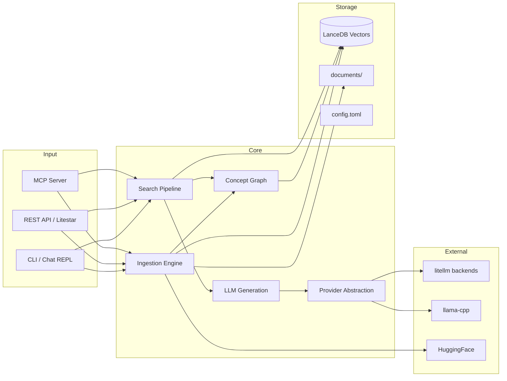
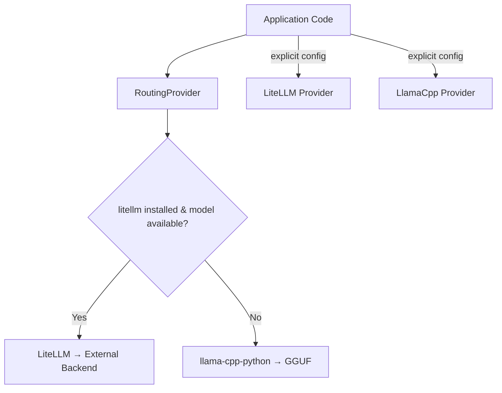
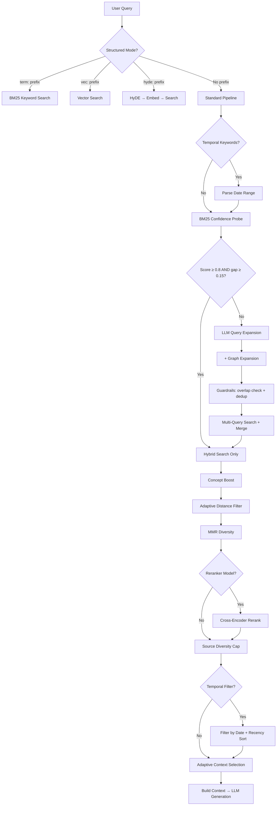

# lilbee Architecture

## What is lilbee?

lilbee is a local knowledge base that lets you ask questions about your documents and get accurate, sourced answers. It runs entirely on your machine — no cloud, no API keys, no data leaving your computer.

You point it at a folder of documents (markdown, code, PDFs, anything), it indexes them, and then you can search or chat with an AI that actually reads your files instead of making things up. Every answer comes with citations showing which documents it used.

It works from the command line, as an API server, as an MCP tool for AI coding assistants, and via the REST API for any client integration.

---

## System Overview

---

## Ingestion Pipeline

Documents are chunked, embedded, and stored as vectors for later retrieval.

- **File discovery**: recursive walk of `documents/`, SHA-256 hash-based change detection — only re-indexes modified files
- **Markdown**: heading-aware chunking via kreuzberg's `chunker_type="markdown"` with `prepend_heading_context=True`. Splits at heading boundaries and prepends the full hierarchy path (e.g., "# Setup > ## Install") so the LLM knows each chunk's section context. Inspired by Anthropic's Contextual Retrieval (2024) which showed adding context to chunks reduces retrieval failures by 49%.
- **Code**: tree-sitter AST splitting via tree-sitter-language-pack 1.3+ for 170+ languages (55 file extensions), with symbol name, type, and line range in chunk headers
- **PDF**: kreuzberg 4.6 extraction with OCR fallback chain (text extraction → Tesseract OCR → vision model). PDF page rasterization delegated to kreuzberg's `PdfPageIterator`.
- **Structured files**: kreuzberg handles XML, JSON, JSONL, YAML, CSV extraction natively. Language detection delegated to tree-sitter-language-pack's `detect_language()`.
- **Web pages**: crawl4ai fetches HTML (with JavaScript rendering via Playwright), converts to markdown, saves to `documents/_web/` for indexing
- **Embedding**: provider-agnostic — works with llama-cpp-python (default) or any litellm-compatible backend (Ollama, OpenAI, etc.)
- **Concept extraction**: spaCy noun phrases extracted per chunk, co-occurrence graph built with PPMI weights, Leiden clustering assigns concepts to communities
- **Storage**: LanceDB with full-text search (FTS) index for hybrid retrieval + concept graph tables (nodes, edges, chunk mappings)

---

## Provider Abstraction

- **auto** (default): `RoutingProvider` checks if litellm is installed and the model is available via its API. If so, uses it; otherwise falls back to local GGUF via llama-cpp.
- **litellm**: force all calls through LiteLLM (Ollama, OpenAI, Azure, etc.). Requires `pip install lilbee[litellm]`.
- **ollama**: deprecated alias for `litellm`
- **llama-cpp**: force local GGUF inference via llama-cpp-python (always available)
- Model downloads come from HuggingFace. lilbee manages its own GGUF files. External models (e.g. Ollama) are used for inference when available but not managed by lilbee.

---

## Search Pipeline

This is the core of lilbee's retrieval quality. The pipeline applies techniques progressively — expensive operations are skipped when simpler ones produce confident results.

### Technique Reference

#### Hybrid Search (BM25 + Vector + RRF)
**Always on.** Combines keyword matching (BM25 via LanceDB FTS) with semantic similarity (vector cosine distance), fused via Reciprocal Rank Fusion.

- **Paper**: Cormack, Clarke & Büttcher 2009, "[Reciprocal Rank Fusion outperforms Condorcet and individual Rank Learning Methods](https://dl.acm.org/doi/10.1145/1571941.1572114)"
- **Tradeoff**: ~5ms overhead vs vector-only search. Worth it because BM25 catches exact keyword matches that vectors miss (e.g. searching for "NavigationServer2D" needs exact string matching, not semantic similarity).
- **When it helps**: queries with specific terms, function names, error messages, exact phrases.

#### MMR Diversity
**Always on.** Maximal Marginal Relevance prevents near-duplicate chunks from filling all result slots.

- **Paper**: Carbonell & Goldstein 1998, "[The Use of MMR, Diversity-Based Reranking](https://dl.acm.org/doi/10.1145/290941.291025)"
- **Default**: λ=0.5 (equal weight to relevance and diversity). This is the standard default from the original paper.
- **Tradeoff**: λ=1.0 gives pure relevance (may return 5 chunks from the same paragraph). λ=0.0 gives maximum diversity (may sacrifice the most relevant result for variety). 0.5 balances both.
- **When to tune**: increase λ for factual lookups ("what is the API key format?"), decrease for exploratory queries ("how does authentication work?").

#### Source Diversity
**Always on.** Caps results per source document so one large file doesn't dominate all top-k slots.

- **Paper**: Zhai 2008, "[Towards a Game-Theoretic Framework for Information Retrieval](https://dl.acm.org/doi/10.1007/978-3-540-78646-7_13)"
- **Default**: 3 chunks per source. Ensures at least 2 different documents appear in top-5 results.
- **Tradeoff**: lower cap = more diverse sources but may miss relevant sections from a single comprehensive document.

#### Query Expansion
**On by default, skipped when BM25 is already confident.** LLM generates 2-3 alternative phrasings of the query, each is searched independently, and results are merged via deduplication.

- **Technique**: standard multi-query retrieval
- **Cost**: 1 LLM call (~200 tokens) + N embedding calls per variant
- **Default**: 3 variants. Set `LILBEE_QUERY_EXPANSION_COUNT=0` to disable entirely.
- **When it helps**: queries using different terminology than the indexed documents. E.g. user asks "how to deploy" but the docs say "installation steps".

#### Confidence-Based Expansion Skip
**On by default.** Before running the expensive LLM expansion call, does a quick BM25 probe. If the top BM25 result is highly confident, expansion is skipped entirely.

- **Technique**: early termination based on BM25 score distribution
- **Default threshold**: 0.80 (90th percentile of sigmoid-normalized BM25 scores)
- **Default gap**: 0.15 (top-1 must be clearly separated from top-2)
- **Threshold derivation**: BM25 scores are normalized via sigmoid centered at ~0.5. Scores above 0.8 represent strong keyword matches. The gap ensures the match isn't ambiguous.
- **Tradeoff**: higher threshold = expansion runs more often (better recall, more latency). Lower = expansion skipped more (faster, may miss some results).
- **Caveat**: these are starting defaults. Calibrate per-corpus using RAGAS evaluation metrics.

#### Expansion Guardrails
**On by default.** Validates LLM-generated query variants to prevent drift.

- **Technique**: token overlap validation + embedding deduplication
- **Overlap threshold**: 0.3 (at least 30% of original query tokens must appear in the variant). Below this, the variant has semantically drifted too far from the original question.
- **Dedup threshold**: cosine similarity > 0.85 between variant embeddings → keep the longer one (more specific).
- **Tradeoff**: guardrails may filter out creative but valid variants. Disable via `LILBEE_EXPANSION_GUARDRAILS=false` if recall is more important than precision.

#### HyDE (Hypothetical Document Embeddings)
**Off by default.** Generates a hypothetical passage (50-100 words) that reads like a real document answering the query, embeds it, and searches with it alongside the original query vector.

- **Paper**: Gao et al. 2022, "[Precise Zero-Shot Dense Retrieval without Relevance Labels](https://arxiv.org/abs/2212.10496)"
- **Cost**: 1 additional LLM call + 1 embedding (~500ms total)
- **Default weight**: 0.7x (hypothetical results are discounted because they're fabricated — they approximate the answer space but aren't grounded in real content)
- **When it helps**: vague or short queries where the user's terminology doesn't match the indexed documents. E.g. "how does the thing work" where the "thing" is described with specific technical vocabulary in the docs.
- **When to skip**: factual lookups, keyword-heavy queries, or when latency matters.

#### Concept Graph (LazyGraphRAG Index Side)
**On by default.** At index time, extracts noun phrases from each chunk via spaCy, builds a co-occurrence graph weighted by Positive Pointwise Mutual Information (PPMI), and clusters concepts with the Leiden algorithm. Zero LLM calls at index or query time.

Two query-time effects:
- **Concept boost**: for each search result, counts concept overlap between the query's noun phrases and the chunk's concepts. Score adjusted by `overlap_ratio × concept_boost_weight` (default 0.3). Only promotes — never demotes.
- **Graph expansion**: traverses the co-occurrence graph (1 hop BFS) to find concepts related to the query. These supplement LLM-generated expansion variants and go through the same drift guardrails.

- **Inspiration**: Microsoft Research 2024-2025, "[LazyGraphRAG](https://www.microsoft.com/en-us/research/blog/lazygraphrag-setting-a-new-standard-for-quality-and-cost/)" — NLP concept extraction at index time, defer reasoning to query time
- **Clustering**: Traag et al. 2019, "[From Louvain to Leiden](https://www.nature.com/articles/s41598-019-41695-z)" via graspologic-native (Rust)
- **Weighting**: Church & Hanks 1990, PPMI — `max(0, log2(P(a,b) / P(a)P(b)))`. Negative values clamped to zero to discard anti-correlated concept pairs.
- **Cost**: ~10ms per chunk at index time (spaCy NLP). Zero additional cost at query time (table lookups only).
- **When it helps**: queries where related but not identical concepts appear across documents. E.g. "connection pooling" finding both database and API performance docs because both mention it alongside related concepts.
- **Browse**: `lilbee topics` shows concept communities — a map of what's in the knowledge base.

#### Cross-Encoder Reranking
**Off by default.** Requires a reranker model to be configured. After hybrid search returns candidates, a cross-encoder model scores each (query, chunk) pair for more precise relevance ranking.

- **Paper**: Nogueira & Cho 2019, "[Passage Re-ranking with BERT](https://arxiv.org/abs/1901.04085)"
- **Position-aware blending**: instead of replacing fusion scores entirely, rerank scores are blended with fusion scores using position-dependent weights:
  - Top 3 results: 70% fusion / 30% rerank (these were already ranked high by fusion for good reason)
  - Positions 4-10: 50% / 50% (equal influence)
  - Positions 11+: 30% fusion / 70% rerank (reranker has more opportunity to rescue misranked items)
- **Blending rationale**: derived from learning-to-rank literature (Burges et al. 2005, "[Learning to Rank using Gradient Descent](https://icml.cc/imls/conferences/2005/proceedings/papers/012_Learning_BurgesEtAl.pdf)"). Top positions already have strong signal — reranker provides diminishing returns there.
- **BM25 protection**: if the rank-1 result has a BM25 score above the expansion skip threshold, it is protected from demotion. This prevents the neural reranker from pushing down obvious exact keyword matches.
- **Cost**: depends on model and candidate count. ~200-500ms for 20 candidates with a small cross-encoder.

#### Adaptive Distance Threshold
**Always on.** When the initial cosine distance filter returns too few results, the threshold is widened step by step until enough results are found or a safety cap is reached.

- **Inspired by**: grantflow ([grantflow-ai/grantflow](https://github.com/grantflow-ai/grantflow)) — adaptive retrieval with recursive threshold retry
- **Default step**: 0.2 (widens from initial `max_distance` in increments)
- **Safety cap**: 20 iterations maximum to prevent runaway loops
- **When it helps**: novel queries or small knowledge bases where strict distance thresholds would return empty results.

#### Adaptive Context Selection
**On by default.** After search results are ranked, selects which chunks to include as LLM context based on query term coverage rather than just taking the top-k.

- **Technique**: greedy set-cover approximation
- **Algorithm**: tokenize query into terms, greedily select chunks that add the most uncovered terms, stop when coverage reaches 100% or marginal gain drops below 5%
- **Default max sources**: 5 chunks
- **When it helps**: multi-faceted queries like "compare X and Y" where top-k might only cover X but context selection ensures Y is also represented.

#### Temporal Filtering
**On by default, activates only when temporal keywords are detected in the query.**

- **Keywords detected**: "recent", "latest", "today", "yesterday", "this week", "last week", "this month", "last month"
- **Date source**: frontmatter `date` field (preferred) or document ingestion timestamp (fallback)
- **Behavior**: when active, retrieves 3x candidates (compensating for filtering loss) and sorts by recency
- **When it helps**: queries like "what changed recently?" or "latest notes about X"

#### Structured Query Modes
**Always available.** Power-user feature for direct control over the retrieval pipeline.

- `term: kubernetes pod scheduling` — BM25 keyword search only (no vector, no expansion)
- `vec: how does container orchestration work` — vector search only (no BM25)
- `hyde: explain the scheduling algorithm` — generate hypothetical document, embed, search
- No prefix → standard hybrid pipeline with all features

Useful for benchmarking (compare BM25 vs vector on the same question), debugging (why isn't this document in keyword results?), and precision (when you know exactly what you want).

---

## Interfaces

### CLI
- `lilbee ask "question"` — one-shot RAG answer with sources
- `lilbee chat` — interactive REPL with `/commands`, history, tab completion
- `lilbee search "query"` — vector search without LLM generation
- `lilbee sync` / `lilbee add` / `lilbee remove` — document management
- `--json` flag on all commands for structured output

### REST API (Litestar)
- `GET /api/search`, `POST /api/ask`, `POST /api/chat/stream` — queries
- `GET /api/documents`, `POST /api/documents/remove` — document management
- `GET /api/models/catalog`, `POST /api/models/pull` — model management
- `GET /api/config` — all settings with descriptions and caveats
- SSE streaming for chat, sync, and model pull progress
- OpenAPI docs at `/schema`

### MCP Server
- `lilbee_search`, `lilbee_status`, `lilbee_sync`, `lilbee_add`
- `lilbee_remove`, `lilbee_list_documents`, `lilbee_reset`
- JSON responses (MCP does not support streaming)

---

## Configuration Reference

All settings are configurable via `LILBEE_*` environment variables, `config.toml`, or `/set` in chat mode. The `GET /api/config` endpoint exposes all current values for API clients.

### Core Settings

| Setting | Default | Description | Caveats |
|---------|---------|-------------|---------|
| `LILBEE_CHAT_MODEL` | `qwen3:8b` | LLM used for chat and ask | Must be installed locally or available via litellm backend |
| `LILBEE_EMBEDDING_MODEL` | `nomic-embed-text` | Model for computing vector embeddings | Changing this requires a full `lilbee rebuild` |
| `LILBEE_TOP_K` | `10` | Number of search results returned | Higher values provide more context but increase LLM latency and token cost |
| `LILBEE_MAX_DISTANCE` | `0.7` | Cosine distance cutoff for vector results | Lower values are stricter — may return fewer results but higher precision |
| `LILBEE_CHUNK_SIZE` | `512` | Target tokens per chunk | Changing requires `lilbee rebuild`. Smaller = more precise retrieval, larger = more context per chunk |
| `LILBEE_CHUNK_OVERLAP` | `100` | Overlap tokens between adjacent chunks | Changing requires `lilbee rebuild`. Prevents information loss at chunk boundaries |
| `LILBEE_SYSTEM_PROMPT` | *(built-in)* | System prompt sent to the LLM | Override per-project for domain-specific behavior |

### Retrieval Quality Settings

| Setting | Default | Description | Caveats |
|---------|---------|-------------|---------|
| `LILBEE_MMR_LAMBDA` | `0.5` | Relevance vs diversity (0.0=diverse, 1.0=relevant) | 0.5 is the standard default from Carbonell & Goldstein 1998. Lower for broad exploratory queries. |
| `LILBEE_DIVERSITY_MAX_PER_SOURCE` | `3` | Max chunks returned per source document | Lower = more diverse sources. Higher = deeper coverage of a single document. |
| `LILBEE_CANDIDATE_MULTIPLIER` | `3` | How many extra candidates to retrieve for MMR | Higher = better diversity selection but slower. 3x is empirically effective. |
| `LILBEE_QUERY_EXPANSION_COUNT` | `3` | Number of LLM-generated query variants | Each variant requires an embedding call. Set to 0 to disable expansion entirely for fastest search. |
| `LILBEE_ADAPTIVE_THRESHOLD_STEP` | `0.2` | Distance filter widening increment | Smaller = more granular adaptation but more filter iterations |
| `LILBEE_EXPANSION_SKIP_THRESHOLD` | `0.8` | BM25 score above which expansion is skipped | 90th percentile of sigmoid-normalized BM25 scores. Calibrate per-corpus. |
| `LILBEE_EXPANSION_SKIP_GAP` | `0.15` | Min score gap (top-1 minus top-2) to skip expansion | Approximately 1 std dev of typical score spread. Ensures the match isn't ambiguous. |
| `LILBEE_EXPANSION_GUARDRAILS` | `true` | Validate expansion variants for drift | Prevents hallucinated variants at the cost of potentially filtering valid creative expansions |
| `LILBEE_MAX_CONTEXT_SOURCES` | `5` | Max chunks included in LLM context | More = more complete answers but higher latency and token cost |
| `LILBEE_HYDE` | `false` | Enable hypothetical document embeddings | Adds ~500ms per query. Best for vague queries where terminology doesn't match docs. |
| `LILBEE_HYDE_WEIGHT` | `0.7` | Weight for HyDE results relative to original | Lower = less trust in hypothetical documents. 0.7 prevents fabricated vectors from dominating. |
| `LILBEE_RERANKER_MODEL` | `""` | Cross-encoder model for reranking (empty=disabled) | Requires `sentence-transformers` installed. Only loaded when configured. |
| `LILBEE_RERANK_CANDIDATES` | `20` | Number of candidates to rerank | More = better precision but slower. 20 is a good balance. |
| `LILBEE_TEMPORAL_FILTERING` | `true` | Enable date-based result filtering | Only activates when temporal keywords are detected in the query |
| `LILBEE_SHOW_REASONING` | `false` | Show reasoning model thinking process | For Qwen3/DeepSeek-R1 models that emit `<think>` tags |
| `LILBEE_CONCEPT_GRAPH` | `true` | Enable concept graph (LazyGraphRAG index) | Extracts noun phrases, builds co-occurrence graph, boosts search by concept overlap |
| `LILBEE_CONCEPT_BOOST_WEIGHT` | `0.3` | Concept overlap boost strength (0.0-1.0) | Higher = concept overlap matters more relative to vector similarity |
| `LILBEE_CONCEPT_MAX_PER_CHUNK` | `10` | Max concepts extracted per chunk | Caps extraction to reduce noise from long chunks |
| `LILBEE_CRAWL_MAX_DEPTH` | `2` | Default recursive crawl depth | How many link hops to follow from the root URL |
| `LILBEE_CRAWL_MAX_PAGES` | `50` | Hard cap on pages per crawl | Enforced regardless of what callers request |
| `LILBEE_CRAWL_TIMEOUT` | `30` | Per-page fetch timeout in seconds | Passed to crawl4ai as page_timeout |
| `LILBEE_CRAWL_MAX_CONCURRENT` | CPU count | Max simultaneous crawl operations | 0 = unlimited. I/O-bound so CPU count is a reasonable default |
| `LILBEE_CRAWL_SYNC_INTERVAL` | `30` | Seconds between periodic syncs during crawl | 0 = sync only after crawl completes. Lower = documents searchable sooner |

### Provider Settings

| Setting | Default | Description | Caveats |
|---------|---------|-------------|---------|
| `LILBEE_LLM_PROVIDER` | `auto` | Backend selection: auto, llama-cpp, litellm | auto = use litellm if installed and reachable, otherwise llama-cpp |
| `LILBEE_LITELLM_BASE_URL` | `http://localhost:11434` | litellm backend endpoint | Also reads `OLLAMA_HOST` for backwards compatibility (deprecated). |

