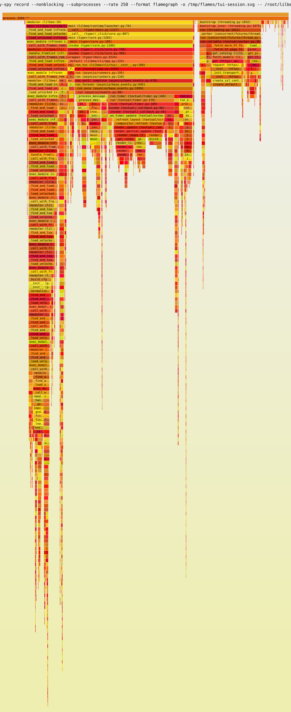

# TUI profiling: real-terminal py-spy session

2026-08-05, lilbee 0.6.90b420.dev731 (`fix/tui-navigation-polish`), RunPod
Secure pod (RTX A4000 host, CPU-bound workload), py-spy 0.4.x at 250 Hz.

## Method

py-spy cannot attach on RunPod containers (no SYS_PTRACE, `ptrace_scope=1`),
so the TUI ran as py-spy's child: `py-spy record --nonblocking --subprocesses
--format flamegraph -o out.svg -- lilbee`, driven in tmux via send-keys
through cold start, the catalog (all six tabs), page-down and arrow scroll
storms, search typing, grid/list toggles, and chat typing. Quitting the TUI
ends the recording cleanly; py-spy flushes on child exit. 2,632 samples.

## Result

The committed SVG is interactive (click to zoom, search) when opened directly.

## Findings

- **`ssl.create_default_context` was the largest self-time frame: 16.5%**
  (441/2,632 samples). Path: catalog `_fetch_remote_models` → Ollama /
  LM Studio discovery probes → one-shot `httpx.get`, which builds a fresh
  `Client` (and with it an SSL context + full CA-bundle load) per probe, on
  every tab activation. Fixed on this branch: discovery now shares one
  client. Micro-benchmark of the mechanism: 6.42 ms per `Client`
  construction vs ~0 for shared reuse.
- **The earlier readiness-poll fix held.** The same disease was previously
  measured at 23% under the task-bar poll and fixed with a shared client in
  `fleet.swap_manager`; this session shows zero SSL frames under that path.
- **No other lilbee-owned hotspot above noise.** Remaining weight is
  Textual's stylesheet/strip/footer machinery on screen switches and
  legitimate HF catalog network work. `ModelGrid`'s strip renderer barely
  registers, consistent with pilot measurements that its paint cost is flat
  from 60 to 900 rows.

## Verdict

One indicted, measured, fixed hotspot; everything else measured and left
alone. Re-profile after any change to discovery, the readiness poll, or the
catalog paint path; the pilot-based `scripts/qa/profile_tui.py` cannot see
service-layer costs (they are mocked there), so real-terminal py-spy is the
tool for those.
