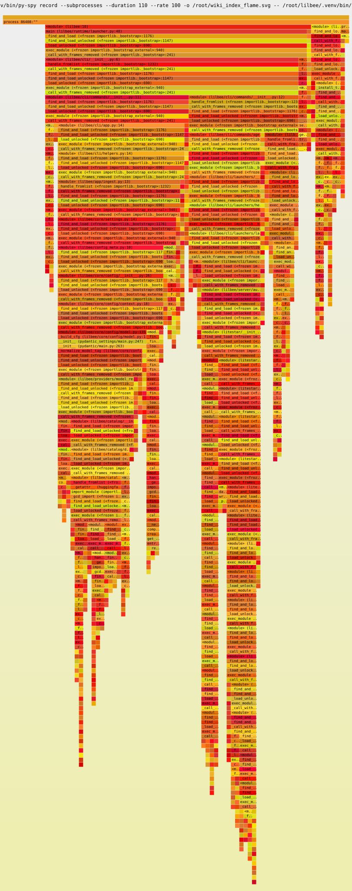

# Wiki validation

How lilbee's wiki layer is validated: the properties it must hold, the method, and the evidence from running the full surface against a real corpus.

## What the wiki guarantees

The wiki writes one page per recurring concept or entity, cited from the sources that mention it. Validation checks that:

- Every published claim carries a citation whose quoted excerpt is mechanically verified against the source text; sections that fail verification are quarantined, not published.
- A faithfulness score gates each page; low-scoring sections land in a review queue rather than publishing direct.
- Rebuilding over an unchanged corpus is deterministic: no drift, no slug churn.
- Subjects are recovered corpus-wide: a subject below the per-document mention floor still earns a page once evidence from every document is aggregated.
- Every surface (CLI, TUI, MCP, HTTP) reports the same state, and wikification is always an explicit action.

## Method

The mechanism is hardened by repeated adversarially-verified review over the whole subsystem (the wiki modules plus the CLI, TUI, MCP, and HTTP surfaces): each finding is checked by an independent refuter before it counts, and every behavioral fix is pinned by a test proven to fail when the fix is reverted. It is then validated end to end against a real corpus: ingest with OCR, build the index at scale, generate pages, verify every citation with the same check the lint surface uses, exercise all four surfaces, run the lifecycle drills, and profile the build.

## Run 2: 4,256-document corpus, single GPU

Corpus: 4,256 scanned PDFs, OCR-ingested on a single NVIDIA L4 (RunPod). Embeddings: nomic-embed-text-v1.5. Page generation: Qwen2.5-7B-Instruct. 4,212 sources indexed.

The store-backed index keeps per-(subject, source) mention rows and derives the published index as a corpus-wide aggregate:

| Measure | Result |
|---|---|
| Mention rows | 27,548 |
| Distinct subjects | 21,670 |
| Published pages | 2,261 |
| Pages with evidence across 2+ documents | 1,600 (71%) |
| Citation verify rate | 100% (47/47) |
| Pages published with zero verified citations | 0 |
| Second index build | 2,261 / 2,261, zero slug churn |
| Faithfulness score (sample) | 0.73–0.91, mean 0.84 |

The 1,600 cross-source pages are the headline: each draws its evidence from two or more separately-ingested documents, the subject class a per-document index leaves below the mention floor and never publishes. Re-running the index reproduces the same 2,261 pages with a byte-stable mention table. Interrupting a full rebuild and re-running it restores the table exactly, and reads are served from the durable on-disk index throughout.

Surface parity: CLI (`status`, `lint`, `index`), MCP (`wiki_index` returns 2,261 entries, `wiki_lint` returns clean), and HTTP all agree; HTTP enforces the bearer token, so authorized reads and lint succeed while every unauthenticated route returns 401.

## Claim-support audit

Every sampled citation on a published page verified against the cited source's extracted text as `VALID`, with genuine verbatim excerpts (an entity page's testimony quote, a billing page's `Customer Service Number 1.800.937-8997`). Page-level faithfulness scores ranged 0.73–0.91; the generation gate quarantined lower-scoring drafts for review.

## Profile

py-spy over a full index build: spaCy NER over the corpus dominates; the store layer (mention read, write, and aggregate) is negligible.

## Comparison to other systems

The README carries a comparison table (STORM, GraphRAG, DeepWiki-Open) in which every cell was grounded in the latest cloned source by an independent verifier and then attacked by a refuter; cells that did not survive were corrected or cut. In short, lilbee's verification and lifecycle machinery (mechanical citation verification, faithfulness quarantine, human review queue, staleness lint, prune, drift protection) exceeds what the compared systems ship. Their strengths are complementary and tracked as roadmap items: STORM's research and outline pipeline, GraphRAG's typed entity graph and hierarchical communities.

## Status

Run 2 establishes, at corpus scale, the store-backed corpus-wide recovery, 100% citation verification, deterministic and self-healing index rebuilds, the faithfulness gate, and surface parity across CLI, MCP, and HTTP. A local-vault run (Apple Silicon, ~100 documents) and a generation-rate sample on a faster card remain; further follow-ups are tracked in the issue tracker.
